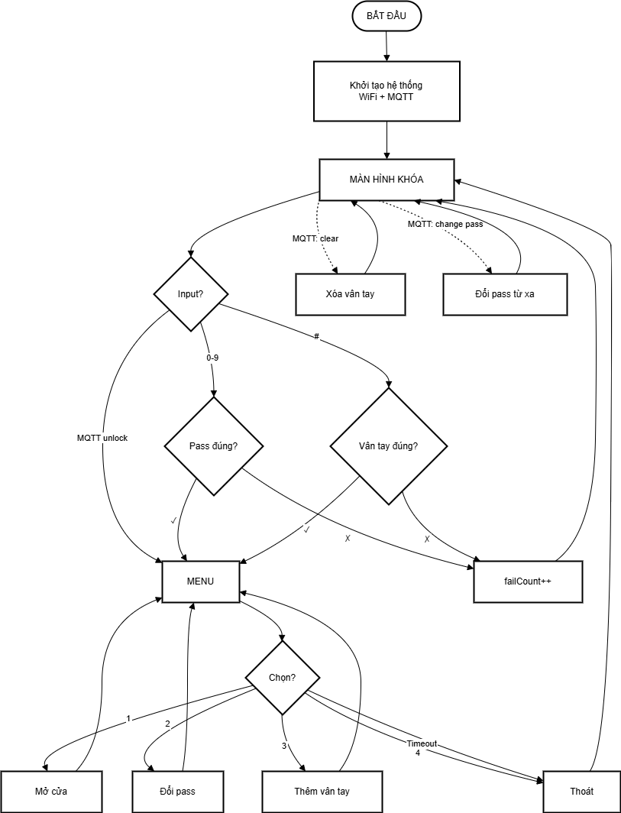

# IotAP-finalproject
Bài tập cuối kỳ môn Lập trình IoT 2025
# 🔐 Smart Door Lock System - ESP32

Hệ thống khóa cửa thông minh sử dụng ESP32 với xác thực vân tay, mật khẩu và điều khiển từ xa qua MQTT.

## ✨ Tính năng

- 🔑 **Xác thực đa phương thức**
  - Mật khẩu 4 số qua keypad
  - Cảm biến vân tay AS608
  - Điều khiển từ xa qua MQTT

- 📱 **Kết nối IoT**
  - Kết nối WiFi
  - Giao thức MQTT qua SSL/TLS
  - Giám sát và điều khiển từ xa

- 🎛️ **Menu quản lý**
  - Mở cửa
  - Thay đổi mật khẩu
  - Thêm/xóa vân tay
  - Auto-timeout bảo mật

- 💾 **Lưu trữ bền vững**
  - Lưu mật khẩu vào Flash
  - Database vân tay (tối đa 127 vân tay)

## 🛠️ Phần cứng yêu cầu

| Linh kiện | Số lượng | Ghi chú |
|-----------|----------|---------|
| ESP32 DevKit V1 | 1 | Vi điều khiển chính |
| Keypad 3x4 | 1 | Nhập mật khẩu |
| LCD I2C 20x4 | 1 | Hiển thị thông tin |
| AS608 Fingerprint Sensor | 1 | Cảm biến vân tay |
| Servo Motor 180° | 1 | Điều khiển khóa cửa |
| LED Red | 1 | Báo trạng thái khóa |
| LED Green | 1 | Báo trạng thái mở |
| Buzzer | 1 | Âm thanh thông báo |
| Nguồn 3.3V-5V | 1 | Cấp nguồn cho các module |

## 📐 Sơ đồ kết nối



## 📦 Cài đặt

### 1. Cài đặt PlatformIO

- Cài đặt [VS Code](https://code.visualstudio.com/)
- Cài extension [PlatformIO IDE](https://platformio.org/install/ide?install=vscode)

### 2. Clone dự án

```bash
git clone https://github.com/HLong23/IotAP-finalproject
cd esp32-smart-lock
```

### 3. Cấu hình WiFi & MQTT

Mở file `src/main.cpp` và chỉnh sửa:

```cpp
// WiFi
const char* WIFI_SSID = "TenWiFi";
const char* WIFI_PASS = "MatKhauWiFi";

// MQTT
const char* MQTT_HOST = "your-mqtt-broker.com";
const int   MQTT_PORT = 8883;
const char* MQTT_USER = "mqtt_username";
const char* MQTT_PASS = "mqtt_password";
```

### 4. Build & Upload

```bash
# Build project
pio run

# Upload to ESP32
pio run --target upload

# Monitor serial
pio device monitor
```

## 🎮 Hướng dẫn sử dụng

### Lần đầu khởi động
- Mật khẩu mặc định: `1234`
- Hệ thống sẽ kết nối WiFi và MQTT tự động

### Mở khóa
1. **Bằng mật khẩu**: Nhập 4 số → Nếu đúng → Vào Menu
2. **Bằng vân tay**: Nhấn `#` → Quét vân tay → Vào Menu

### Menu chức năng
```
1: OpenDoor    - Mở cửa 3 giây
2: ChangePass  - Đổi mật khẩu
3: AddFinger   - Thêm vân tay mới
4: Exit        - Thoát menu
```

### Điều khiển qua MQTT

**Topics:**
- `door/status` - Trạng thái cửa (publish)
- `door/command` - Lệnh điều khiển (subscribe)
- `door/fingerprint` - Trạng thái vân tay (publish)

**Commands:**
```bash
# Mở khóa từ xa
mosquitto_pub -h broker.com -t door/command -m "unlock"

# Đổi mật khẩu
mosquitto_pub -h broker.com -t door/command -m "change_password5678"

# Xóa tất cả vân tay
mosquitto_pub -h broker.com -t door/command -m "clear_all_fingers"
```

## 🔒 Bảo mật

- ✅ Mật khẩu lưu trong Flash, không hardcode
- ✅ Kết nối MQTT qua SSL/TLS (port 8883)
- ✅ Giới hạn số lần nhập sai (tùy chỉnh)
- ✅ Auto-timeout menu sau 10 giây

## 📊 Sơ đồ hoạt động


## 🐛 Xử lý sự cố

### ESP32 không kết nối WiFi
- Kiểm tra SSID và password
- Đảm bảo WiFi 2.4GHz (ESP32 không hỗ trợ 5GHz)

### MQTT không kết nối
- Kiểm tra broker host/port
- Kiểm tra username/password
- Đảm bảo broker hỗ trợ SSL/TLS port 8883

### Vân tay không nhận diện
- Đảm bảo AS608 dùng nguồn 3.3V
- Kiểm tra kết nối TX/RX (có thể bị đảo ngược)
- Thử thêm lại vân tay

### LCD không hiển thị
- Kiểm tra địa chỉ I2C (mặc định 0x3F)
- Điều chỉnh độ tương phản bằng biến trở trên LCD

## 📚 Thư viện sử dụng

- [Adafruit Fingerprint Sensor Library](https://github.com/adafruit/Adafruit-Fingerprint-Sensor-Library) - v2.1.3
- [PubSubClient](https://github.com/knolleary/pubsubclient) - v2.8
- LiquidCrystal_I2C
- Arduino Preferences

## 📝 License

MIT License - Tự do sử dụng cho mục đích cá nhân và thương mại.

## 🎥 Video Demo

📌 Video demo được lưu trong Google Drive  
🔗 **Link:** https://drive.google.com/drive/folders/1uHiy6g_S8fmBADvmaXDNY2Mxs97cFy2M

